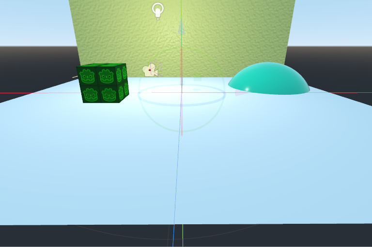
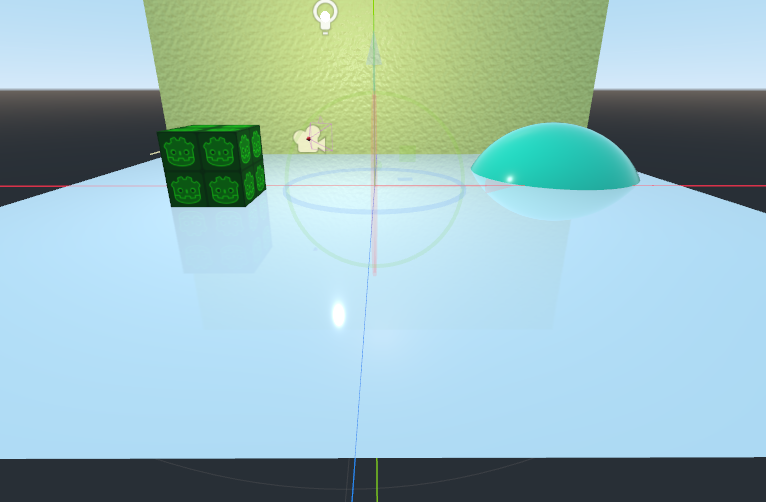
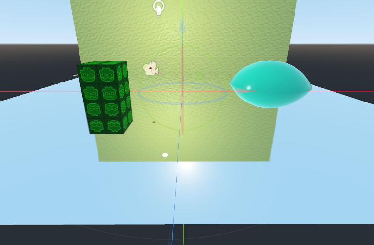
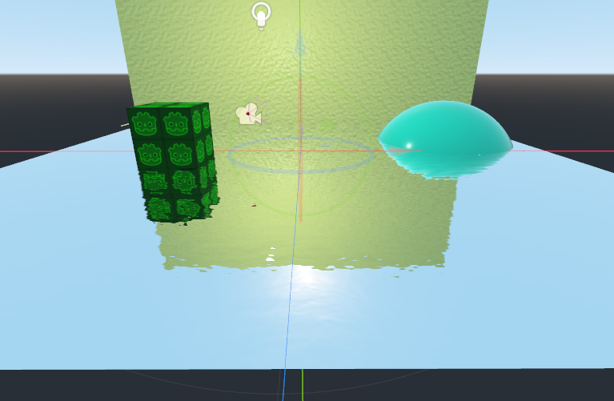
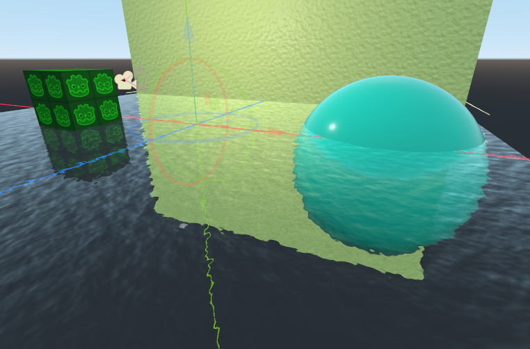
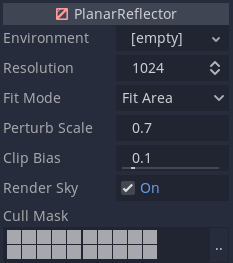

# Godot-Planar-Reflection-Plugin

Greetings! This plugin, as the name implies adds planar reflection to the Godot game engine. 3.2 to be more specific. The effect comes in the form of a node called `PlanarReflector`. Add any smooth material to it, and watch as objects in the scene are faithfully reflected on it.

## Installation

Whether you're downloading it from the github repo, or from the Godot asset library, the plugin will be inside the `addons` folder. copy that folder into your project's `addons` folder. If you don't have such a folder, make one.

## Usage

As stated before, the plugin adds a new node called `PlanarReflector`. All you need to get reflections set up is

1. Add a `PlanarReflector` to the scene.
2. Add a material. Preferably a `SpatialMaterial`.
3. Adjust the default geometry as needed.

At first you won't see a reflection, but that's because the default material has a high roughness parameter.

If you turn the roughness down however,

Voila! You've got a reflection. Setting the Metallic all the way up will give you a mirror. Cool huh?

The `PlanarReflector` works with most of the `SpatialMaterial` settings. It can even work with normal maps.

It also works with `ShaderMaterials`. Which means you can finally have that beautiful reflection in your pond. :)

What's also great is that the reflections can be previewed directly in the editor, as the pictures above show. Sure the reflection lags behind when you move it, but it's better than nothing. ;)

### Parameters

The `PlanarReflector` has the following parameters available.

* `Environment` - A custom environment for the reflection to be rendered with.
* `Resolution` - The resolution of the reflection. A higher value gives a crispier look, but also reduces performance. You could probably use a low resolution to simulate rough reflections.
* `Fit Mode` - How the reflection is fit onto the plane.
  * `Fit Area` - Fits it onto the entire area. The apparent resolution stays the same.
  * `Fit View` - Fits it into your view. The apparent resolution will change with what part of the plane is visible.
* `Perturb Scale` - How much the plane is distorted by normals.
* `Clip Bias` - How much geometry is rendered beyond the reflection plane. You can increase this in case you start seeing seams caused by normal distortion.
* `Render Sky` - Whether to render the environment into the reflection. This allows you to mix planar reflection with other sources of reflections, such as `ReflectionProbes`.
* `Cull Mask` - What gets rendered into the reflection. This allows you to choose what things can be seen in a reflection.

## Limitations

* The planar reflection will still be visible in unshaded materials, but honestly, why would use an unshaded material to begin with? :/

* The reflection doesn't work properly on double-sided materials. More specifically on the opposite side of the plane.
* Materials stored directly in the reflector's mesh will have no effect.
* Specular highlights, from point lights and such, don't appear in metallic reflections. This can be worked around by disabling `Render Sky`. The highlight will appear where there is no geometry.

## Special thanks

This project wouldn't have been possible without inspiration from JFons' [Godot Mirror Example](https://github.com/JFonS/godot-mirror-example). His code is the core of the planar reflector's script. :)

Also the code for camera movement in the demo is by [Maujoe](https://github.com/Maujoe/godot-camera-control).